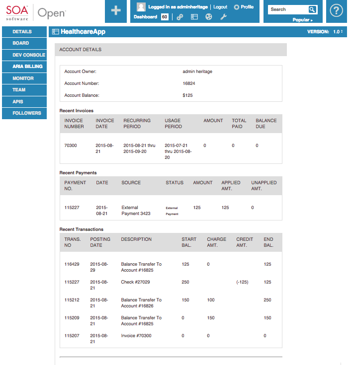

# Akana Community Manager Integration
![Image of Akana] 
(https://www.akana.com/img/formerlyLOGO8.png) 
[Akana.com](http://akana.com)

## Aria Community Manager Integration
This integration demonstrates the integration of Aria Systems billing solution with Akana Community Manager to give you powerful subscription billing capabilities for your APIs. 


### About the Aria Systems
Aria Systems is a cloud billing platform.

Learn more at [Aria Systems](www.ariasystems.com)

### Pre-Reqs
- You must have an account with Aria Systems
    + You must have a Global Master Plan defined as the default
    + You must have sub-plans defined that automatically get rolled up to the Global Master Plan (GMP)
    + Sub-Plans map to licenses defined in Community Manager
        + Note when an App gets created in Community Manager an account is create in Aria and assigned the Global Master Plan.  When that App subscribes to an API with a license that is mapped to a subplan in Aria, an account is created with the GMP and the sub-plan. All accounting is rolled up to the GMP which allows us to send out one invoice per App with all of its APIs.  
- You need Policy Manager v7.2.11 or later
- You need Community Manager v7.2.4.1 or later
- You must install the pso extensions custom polices:
    + Download the zip and follow the instructions [here](http://github.com/akanainc/akana-pso-tools/tree/master/akana-pso-apihooks-extensions)
- You must install the pso technical preview:
    + Download the zip and follow the instructions [here](https://github.com/akanainc/akana-pso-tools/tree/master/akana-pso-apihook-technology-preview)
  
- You need to install the Aria trusted CA certs into Policy Manager
    + From the Policy Manager console (example: http://localhost:9900) 
        + click on Configure -> Security -> Certificates -> Trusted CA Certificates
        + click Add Trusted CA Certificates
            + Add the complete hierarchy (Note: you need to download the certs by pointing your browser at the Aria System's secure endpoint and saving each cert in the hierarchy)

### Getting Started Instructions
#### Download and Import
- Download Aria_Hooks.zip
- Login to PolicyManager  example: http://localhost:9900
- Select the root "Registry" organization and click on the "Import Package" from the Actions navigation window on the right side of the screen
  - click on button to browse for the Aria_Hooks.zip archive file 
  - click Okay to start the importation of the hook.
  - when prompted click Okay to deploy the virtual service to the container later.
- this will create a Aria Hooks Organization with the requisite artifacts needed to run the API.

#### Verify Import
- Expand the services folder in the Aria Hooks you imported and find Box_API_Hook VS

#### Host Virtual Services
- There are two virtual services that need hosting on your nd container
    + Aria_BillingComplete_REST_API_vs0
        + location:  /aria/v2
    + Aria_Object_Query_API_vs0
        + location:  /ariaquery/v2

#### Activate Anonymous Contract
- Expand the contracts folder in the Google Sheets API Hook you imported and find the "AriaOpen"  and "AriaQueryOpen" contracts under the "Provided Contracts" folder
- for each contract click on the "Activate Contract" workflow activity in the right-hand Activities portlet
- ensure that the status changes to "Workflow Is Completed"


#### Run the Aria Setup Postman transactions:
- Load the collection into Postman
- Change the host/port in all the URLs to be your system
- Change the Basic Auth settings if you have something besides administrator/password for your Policy Manager authentication
- Edit the TenantInfo Body
    + Change the following
        + ariaId to your aria client_no
        + ariaKey to your aria auth_key 
        + ariaHost to the Policy Manager host where SimpleThings is running
        + set your payment defaults
        + set the master plan

        ```
        {
          "ariaId" : "8000042",
          "ariaKey" : "jnXkeuskEA39hnse3sGph3yndUPKj8dX",
          "ariaHost" : "http://heritage.soa.local:5501" ,
          "defaults" : {
            "country" : "US",
            "currency" : "usd",
            "paymentMethod" : 4,
            "parentRespLevel" : 1,
            "childRespLevel" : 2
          },
          "appVersionPlan" : {
            "master_plan_no" : 332,
            "master_plan_units" : 1
          }
        }

        ```

    + Run the “TenantInfo” request
- You will need to create/customize the LicenseMap transactions for your own system. You will need to know: 
    - LicenseId for all Akana Community Manager licenses to be mapped. The easiest/only way of getting the LicenseId is to:
        + Export the license from community manager
        + Look at the objectdata.xml file inside the export zip.
        + Get the content of the <LicenseID> element. It should look something like: e86a94ba-b8f7-4321-8c7e-6795144e412c.acme
    - The Master Plan and Supplemental Plan numbers to be mapped. You can easily get these from Aria Systems UI. 
- Edit or create new LicenseMaps   
    - The LicenseId needs to go in the Postman “LicenseMap” transactions two places:
        + In the URL path: /simplethings/Aria/license/<licenseid>.json
        + In the $/CM/id JSON element
    - The Aria Master Plan number needs to go into the …/AccountProperties/master_plan_no element in both sandbox and production
    - The Aria Supplemental Plan number needs to go two places in the sandbox and production elements:
        + $/Aria/plans/(sandbox|production)/plan
        + $/Aria/plans/(sandbox|production)/accountProperties/supp_plans
    - Example LicenseMap
    ```
            {
              "CM" : {
                "id" : "20f080cc-04d9-4667-bab7-be43433c7110.heritage",
                "name" : "Silver",
                "description" : "This is the SILVER license"
              },
              "Aria" : {
                "defaultPlan" : "sandbox",
                "plans" : {
                  "sandbox" : {
                    "plan" : 387,
                    "accountProperties" : {
                      "master_plan_no" : 332,
                      "master_plan_units" : 1,
                      "supp_plans" : 387,
                      "supp_plan_units" : 1
                    },
                    "serviceProperties" : {
                      "gl_cd" : 1100,
                      "service_type" : "Usage-Based",
                      "usage_type" : 10019257
                    },
                    "planServiceProperties" : {
                      "rate_type" : "Tiered Pricing",
                      "pricing_rule" : "Standard",
                      "schedule" : [
                        { "schedule_name": "Silver Schedule",
                          "currency_cd" : "usd",
                          "is_default" : 1 }
                      ],
                      "tier" : [
                        { "from" : 0, "to" : 50000,
                          "schedule" : [ {"amount" : 0} ] },
                        { "from" : 50001, "to" : null, 
                          "schedule" : [ {"amount" : 0.01} ] }
                      ]
                    }
                  },
                  "production" : {
                    "plan" : 387,
                    "accountProperties" : {
                      "master_plan_no" : 332,
                      "master_plan_units" : 1,
                      "supp_plans" : 387,
                      "supp_plan_units" : 1
                    },
                    "serviceProperties" : {
                      "gl_cd" : 1100,
                      "service_type" : "Usage-Based",
                      "usage_type" : 10019257
                    },
                    "planServiceProperties" : {
                      "rate_type" : "Tiered Pricing",
                      "pricing_rule" : "Standard",
                      "schedule" : [
                        { "schedule_name": "Silver Schedule",
                          "currency_cd" : "usd",
                          "is_default" : 1 }
                      ],
                      "tier" : [
                        { "from" : 0, "to" : 50000,
                          "schedule" : [ {"amount" : 0} ] },
                        { "from" : 50001, "to" : null, 
                          "schedule" : [ {"amount" : 0.01} ] }
                      ]
                    }
                  }
                }
              }
            }

    ```
    - You need a separate “LicenseMap” transaction for each license that needs to be mapped to an Aria plan


#### Import the theme into Community Manager
#####There are two options for installation of the theme.
1. From Community Manager's Config - Resources page, under Resource click on File Manager, and then click on Upload a Zip Archive.  Point to the dist/resource/theme.zip you download from github.
2. Change the configuration of you community manager to load the theme from a directory by:
    + Clone the GitHub repository
    + Logging into the admin console http://localhost:9900/admin
    + Clicking on Configuration
    + Select com.soa.atmosphere from the left nav.
        + Change the atmosphere.config.loadResourcesFromWorkspace to true
        + Change atmosphere atmosphere.config.resourcesPath :  {yourrootpath}/AkanaInc/aria-cm-integration/src/com.akana.aria
    + Restart CM

For both options:
+ On the configuration view, go to  CONFIG -> CUSTOM SYTLES and click Rebuild Styles
+ Clear your browser cache.

##### Change SimpleThings username / password
- Open the theme/default/DEMO/aria/ariaCan.js
    + find the getAccountIdFromThings function
    + change the username and password in the ajax call to the username and password that can access SimpleThings.  This is usually the same as your Policy Manager logon in development. 

Option #2 is good for if you are going to do further developement on the theme.

##### What is in the theme
+ theme/default/DEMO/aria - Contains the files for the Community Manager Aria widget
+ SOA/CM/extensions - These files basically register the widget with the UI and create a the view
    + Left_nav.json - Overides the default left nav configuration and adds the Aria link on the left navigation on the APP view for the owner of the APP.  You can configure this how you wish.
    + widget_factor.json - Defines the new widget. References the ejs files from the /theme/default/DEMO/aria directory
    + metadata.json - Defines the new aria view.  It references the widget key you defined in the widget_factory.json
+ locales and i18n - Are for Internationalization
+ less
    + custom.less - I set leftnav-active-icons: none;
    ```
    // path to the image file of 18px sprites of leftnav navigation items that reflect the current section of "subject" details
    @leftnav-active-icons: none;

    ```


### License
Copyright 2015 Akana, Inc.

Licensed under the Apache License, Version 2.0 (the "License");
you may not use this file except in compliance with the License.
You may obtain a copy of the License at

    http://www.apache.org/licenses/LICENSE-2.0

Unless required by applicable law or agreed to in writing, software
distributed under the License is distributed on an "AS IS" BASIS,
WITHOUT WARRANTIES OR CONDITIONS OF ANY KIND, either express or implied.
See the License for the specific language governing permissions and
limitations under the License.

